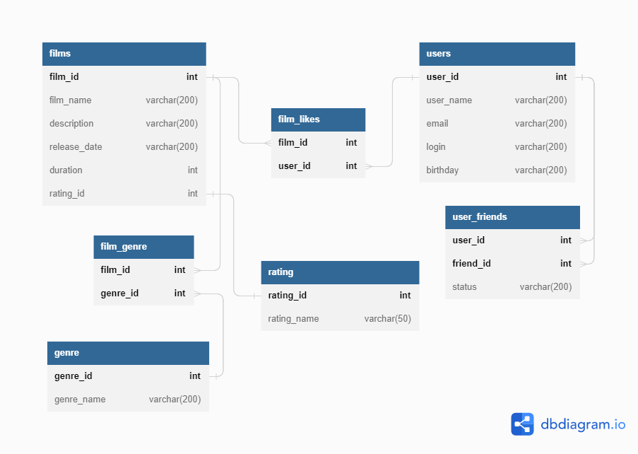

# java-filmorate
Template repository for Filmorate project.

### Примеры запросов:

**- получить список фильмов и жанр:**

SELECT  f.id, f.name, g.name
FROM film AS f
INNER JOIN film_genre AS fg ON f.id = fg.film_id
INNER JOIN genre AS g ON fg.genre_id = g.id;

**- получить список фильмов и пользователей, которые поставили лайк:**

SELECT f.id, f.name, fl.user_id, u.name
FROM film AS f
INNER JOIN film_likes AS fl ON f.id = fl.film_id
INNER JOIN "user" AS u ON u.id =fl.user_id;

**- получить список фильмов и количество лайков:**

SELECT f.id, f.name, count(fl.user_id) AS like_count
FROM film AS f
INNER JOIN film_likes AS fl on f.id = fl.film_id
GROUP by f.id
ORDER BY like_count DESC;

**- получить список всех друзей пользователя с ID 1**

SELECT  u.id, u."name", uf.friend_id, u2.name
FROM  user_friends AS uf
LEFT OUTER JOIN "user" u on u.id = uf.user_id
LEFT OUTER JOIN "user" as u2 on u2.id = uf.friend_id
LEFT OUTER JOIN friend_status fs2 on uf.status_id = fs2.id
WHERE u.id = 1;
